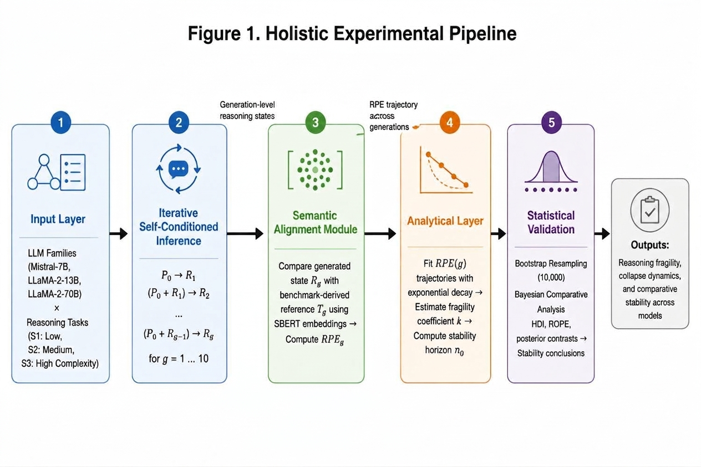
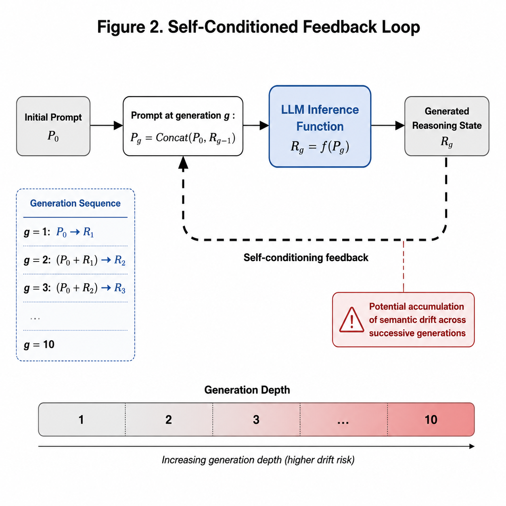
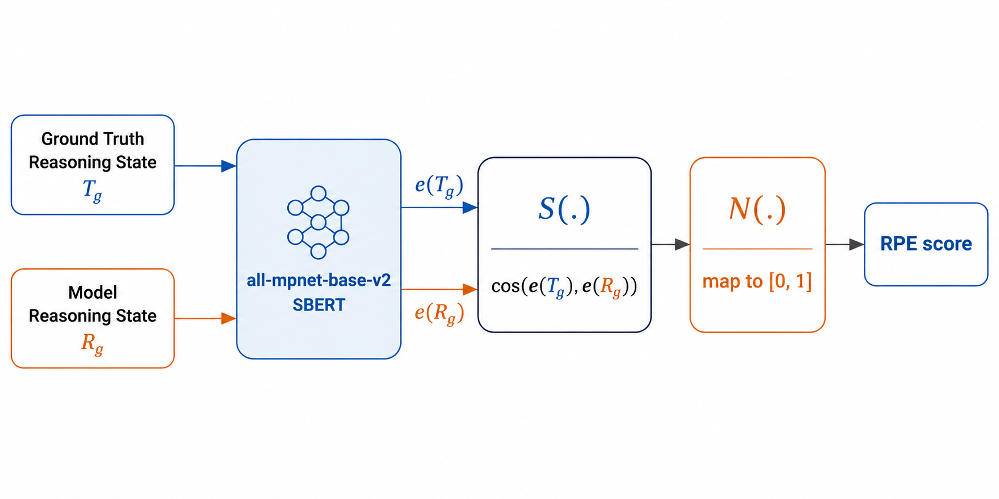
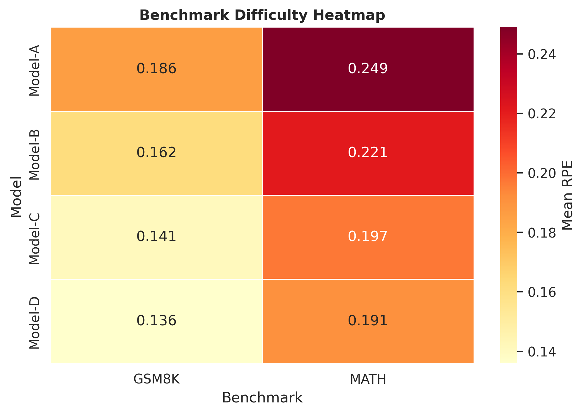

# Quantifying the Fragility of Reasoning in Successive Generations of Large Language Models

[](https://doi.org/10.5281/zenodo.20785071)
[](LICENSE)
[](https://www.python.org/)

---

## Figure Gallery

<table>
  <tr>
    <td align="center"><b>Graphical Abstract</b><br></td>
    <td align="center"><b>Figure 1</b><br></td>
    <td align="center"><b>Figure 2</b><br></td>
  </tr>
  <tr>
    <td align="center"><b>Figure 3</b><br></td>
    <td align="center"><b>Figure 4</b><br></td>
    <td align="center"><b>Figure 5</b><br></td>
  </tr>
  <tr>
    <td align="center"><b>Figure 6</b><br></td>
    <td align="center"><b>Figure 7</b><br></td>
    <td align="center"><b>Figure 8</b><br></td>
  </tr>
</table>

---

## Overview

This repository contains the empirical datasets, analysis notebooks, and figure-generation code for the manuscript:

**Quantifying the Fragility of Reasoning in Successive Generations of Large Language Models**  
**Manuscript ID:** NLP-2026-0255

The project investigates how reasoning quality degrades across successive generations of large language models using semantic similarity, fragility coefficients, Bayesian stability horizons, and related analyses.

---

## Repository Contents

- `data/` — empirical datasets and derived tables
- `figures/` — publication-quality figures
- `notebooks/` — reproducible analysis notebooks
- `appendices/` — supplementary materials
- `README.md` — project overview and documentation

---

## Key Outputs

- Recursive reasoning performance evaluation
- Fragility coefficient estimation
- Bayesian stability horizon analysis
- Publication-ready figure generation
- Reproducible notebook workflow

---

## DOI and Citation

If you use this repository, please cite it as:

**DOI:** https://doi.org/10.5281/zenodo.20785071

### BibTeX
```bibtex
@software{merrikhi_2026_fragility,
  author  = {Merrikhi, Pegah},
  title   = {Quantifying the Fragility of Reasoning in Successive Generations of Large Language Models},
  year    = {2026},
  doi     = {10.5281/zenodo.20785071},
  url     = {https://doi.org/10.5281/zenodo.20785071}
}
